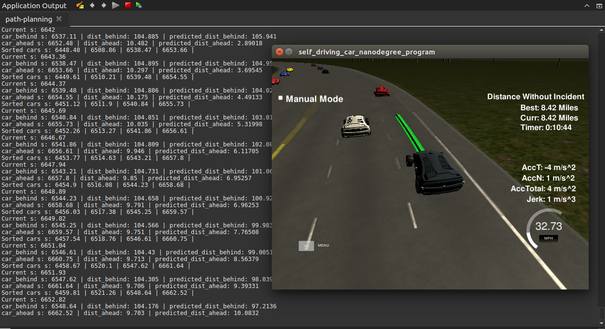

# CarND-Path-Planning-Project
This is the Path Planning project of the Self-Driving Car Engineer Nanodegree Program.
First, the used approach is documented. Secondly, the software engineering approach of implementing the project is described, as some effort was put into this.
Lastly, provided project information is restated.

## Model Documentation
The project "Path Planning" consists of three main blocks, Behavior Planning, Prediction and Trajectory Generation.

###  Behavior Planning
Behavior Planning is established upon a finite state machine consisting of five states: `Keep Lane`, `Prepare Lane Change Left/Right`, `Lane Change Left/Right`.
There is a set of transition functions when the behavior planner encounters a situation where a change in states makes sense.
Starting from the "Keep Lane" state, if another vehicle in front is too slow, it evaluates the speed of the vehicles left and right of the current lane and choose to prepare a lane change to the lane with the higher speed.

In the "Preparation" state, the gap between the to-be-followed car on the desired lane and the car behind it is computed.
If considered safe to change lanes, a transition into "Change Lane" state is triggered, the direction depends on the best speed gains for left and right.
Once this state is active, the lane change is executed until the next lane is reached. This event is marked as "Lane Change Completed" and state transitions again into "Keep Lane".
There is no abortion of a lane change, once planned - however, it remains a point of improvement, since the behavior planning works "rule based" and is a trade off between safety and efficiency.
For example, a vehicle approaching us very quick might still allow for a lane change, but during the lane change it might be evaluated to risky and an abortion would make sense.

During development cost functions were evaluated, but eventually not used. A cost function would have been meaningful in combination with a set of certain generated trajectories.
We could then take each of the trajectories and compute the cost of executing this, with respect to efficiency, law-compliance and other properties.
However, for the simple case of the project, a rule based behavior planning is used which decides first bevor generating the one and only trajectory.

### Prediction
The prediction module tries to predict other vehicles into the future. The motivation for this module is to reflect a better and more realistic driving scenario, comparable to what humans would do.
Instead of just looking at the very moment of a certain driving situation, we predict the behavior of all other agents some seconds into the future.
It comes in beneficial when computing gaps for a planned lane change. A lane change is only safe if a certain gap size is available.
A prediction helps to safely execute a lane change since we incorporate the time needed for the lane change to be executed.

Specifically, a constant speed model has been used for other traffic participants. This is, we expect the cars to travel at a constant speed in their own lane.
The prediction horizon was tuned to gain best results and lays in the magnitude of seconds. This model is heavily simplified, as it does not encounter speed changes or lane change intentions of other vehicles. However, it serves the purpose of the task and can easily extended.

### Trajectory Generation
The trajectories are generated using a cubic spline. During behavior planning, we decide for a target lane and a target speed. Those information is used for generating anchor points for a spline fitting.
Two anchor points come from previous paths. One is the very first point and the other the current position of the car. Three additional ones are taken from a certain distance and already targeting the goal lane.
Target speed is used for the distance of the generated spline points. Once a spline is in place, we sample it accordingly, so that the resulting speed is close to the target speed.
We exploit the fact that the simulator has a constant frequency and consumes one point each 0.02 seconds. We can derive the required distance between points considering maximum acceleration and maximum allowed speed.

## Results
This image shows a screenshot with a distance driven which exceeds the requirement in the project's rubric.


This video shows a uncut drive with a recent version of this project.
](https://www.youtube.com/watch?v=J4eMer3537I)

### Rubric
* The code compiles correctly.
* The car is able to drive at least 4.32 miles without incident.
* The car drives according to the speed limit.
* Max Acceleration and Jerk are not Exceeded.
* Car does not have collisions.
* The car stays in its lane, except for the time between changing lanes.
* The car is able to change lanes
* There is a reflection on how to generate paths.

## Software Structure
The meat of the implementation is found in the `DrivingStateMachine` class. Here, each state inherits from the main class and implements the virtual methods, such as react, entry and exit.
Each time, a new input from simulator is received, the `react method` (with the input as a payload) is triggered for the current state.
The state itself then figures out what to do next and can trigger a transition to a next successor state.

There are a couple of classes which mainly come from the started code provided by fspirit (see references). It eases working with the code, as we increase encapsulation and more follow the SOLID principles.
There also are some sources left overs from experiments (i.e. the Cost, Road and Vehicle classes adapted from the Udacity quizzes). I intentionally left those inside the project and it might inspire others.

Once a good solution was found, characterization tests have been written to conserve this behavior and to enable further refactor and improve the code structure.
Those use the `.json` files, received and sent out from the simulator, and simply records those on the local machine. Test then can import those recorded jsons, playback the core of the path planning, and compare outputs with what has been recorded previously. On the software side, this expected the path planning core to be a library, which is linked against the test and the actual project executable, as can be seen in the groomed CMakeLists.

For example, `./path-planning-test ../test-data/input-advanced.json ../test-data/response-advanced.json ../data/highway_map.csv` invokes a tests for a recoreded behvaior. Note that due to the fact that small tuning took place, it is not guaranteed that those tests still hol.d

### References
Some reference which eased the development of this project is stated below.

For the state machine implementation, the tinyfsm library was used. It handles all states, transitions, entry, exit functions and is easy to use.
- https://github.com/digint/tinyfsm

Since the quality of the started code provided by Udacity in terms of clean code is improvable, a new started code base provided by fspirit has been used. Here, the very same functionality of the code walkthrough was implemented a more object-oriented, SOLID and clean way.
- https://github.com/fspirit/path-planning-starter

As already stated in the project definition, a spline library was incorporated into the project.
- http://kluge.in-chemnitz.de/opensource/spline/

Some ideas for bootstrapping the behavior planning was obtained from a solution found here.
- https://github.com/maxritter/SDC-Path-Planning

Some experiments have been done using a PID controller, but eventually did not find into the final project submission.
- https://gist.github.com/bradley219/5373998

## Udacity Documentation

### Goals
In this project your goal is to safely navigate around a virtual highway with other traffic that is driving +-10 MPH of the 50 MPH speed limit. You will be provided the car's localization and sensor fusion data, there is also a sparse map list of waypoints around the highway. The car should try to go as close as possible to the 50 MPH speed limit, which means passing slower traffic when possible, note that other cars will try to change lanes too. The car should avoid hitting other cars at all cost as well as driving inside of the marked road lanes at all times, unless going from one lane to another. The car should be able to make one complete loop around the 6946m highway. Since the car is trying to go 50 MPH, it should take a little over 5 minutes to complete 1 loop. Also the car should not experience total acceleration over 10 m/s^2 and jerk that is greater than 10 m/s^3.

#### The map of the highway is in data/highway_map.txt
Each waypoint in the list contains  [x,y,s,dx,dy] values. x and y are the waypoint's map coordinate position, the s value is the distance along the road to get to that waypoint in meters, the dx and dy values define the unit normal vector pointing outward of the highway loop.

The highway's waypoints loop around so the frenet s value, distance along the road, goes from 0 to 6945.554.

## Basic Build Instructions

1. Clone this repo.
2. Make a build directory: `mkdir build && cd build`
3. Compile: `cmake .. && make`
4. Run it: `./path-planning`.

### Simulator.
You can download the Term3 Simulator which contains the Path Planning Project from the [releases tab (https://github.com/udacity/self-driving-car-sim/releases).

Here is the data provided from the Simulator to the C++ Program

#### Main car's localization Data (No Noise)

["x"] The car's x position in map coordinates
["y"] The car's y position in map coordinates
["s"] The car's s position in frenet coordinates
["d"] The car's d position in frenet coordinates
["yaw"] The car's yaw angle in the map
["speed"] The car's speed in MPH

#### Previous path data given to the Planner

//Note: Return the previous list but with processed points removed, can be a nice tool to show how far along
the path has processed since last time.

["previous_path_x"] The previous list of x points previously given to the simulator
["previous_path_y"] The previous list of y points previously given to the simulator

#### Previous path's end s and d values

["end_path_s"] The previous list's last point's frenet s value
["end_path_d"] The previous list's last point's frenet d value

#### Sensor Fusion Data, a list of all other car's attributes on the same side of the road. (No Noise)

["sensor_fusion"] A 2d vector of cars and then that car's [car's unique ID, car's x position in map coordinates, car's y position in map coordinates, car's x velocity in m/s, car's y velocity in m/s, car's s position in frenet coordinates, car's d position in frenet coordinates.

## Details

1. The car uses a perfect controller and will visit every (x,y) point it recieves in the list every .02 seconds. The units for the (x,y) points are in meters and the spacing of the points determines the speed of the car. The vector going from a point to the next point in the list dictates the angle of the car. Acceleration both in the tangential and normal directions is measured along with the jerk, the rate of change of total Acceleration. The (x,y) point paths that the planner recieves should not have a total acceleration that goes over 10 m/s^2, also the jerk should not go over 50 m/s^3. (NOTE: As this is BETA, these requirements might change. Also currently jerk is over a .02 second interval, it would probably be better to average total acceleration over 1 second and measure jerk from that.

2. There will be some latency between the simulator running and the path planner returning a path, with optimized code usually its not very long maybe just 1-3 time steps. During this delay the simulator will continue using points that it was last given, because of this its a good idea to store the last points you have used so you can have a smooth transition. previous_path_x, and previous_path_y can be helpful for this transition since they show the last points given to the simulator controller with the processed points already removed. You would either return a path that extends this previous path or make sure to create a new path that has a smooth transition with this last path.

---

## Dependencies

* cmake >= 3.5
 * All OSes: [click here for installation instructions](https://cmake.org/install/)
* make >= 4.1
  * Linux: make is installed by default on most Linux distros
  * Mac: [install Xcode command line tools to get make](https://developer.apple.com/xcode/features/)
  * Windows: [Click here for installation instructions](http://gnuwin32.sourceforge.net/packages/make.htm)
* gcc/g++ >= 5.4
  * Linux: gcc / g++ is installed by default on most Linux distros
  * Mac: same deal as make - [install Xcode command line tools]((https://developer.apple.com/xcode/features/)
  * Windows: recommend using [MinGW](http://www.mingw.org/)
* [uWebSockets](https://github.com/uWebSockets/uWebSockets)
  * Run either `install-mac.sh` or `install-ubuntu.sh`.
  * If you install from source, checkout to commit `e94b6e1`, i.e.
    ```
    git clone https://github.com/uWebSockets/uWebSockets
    cd uWebSockets
    git checkout e94b6e1
    ```

## Code Style

Using clang-format it is ensured to comply with the  [Google's C++ style guide](https://google.github.io/styleguide/cppguide.html).
